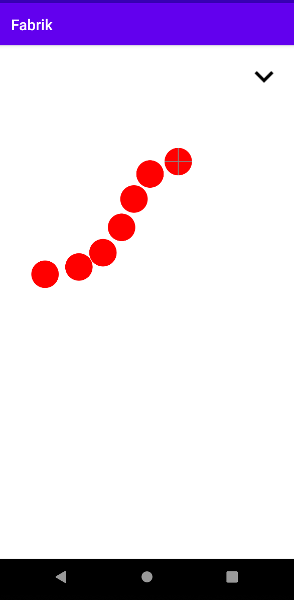

# Fabrik

FABRIK IK solver and visualizer for Android

## What it does

- Create chains of joints represented by dots
- Play with the chain's end effector
- Save and load chains

## What is FABRIK?

Forward And Backward Reaching Inverse Kinematics is a method of solving
inverse kinematics. This means it calculates the position of all joints
in a chain to reach a goal.

This is an intuitive skill learned by almost all animals. It is useful 
for movement such as walking. In video games, inverse kinematics is
used to reposition the legs of a character so that they appear to
naturally stand on an uneven surface such as stairs.

[Additional information](https://docs.unrealengine.com/en-US/Engine/Animation/IKSetups/index.html)

FABRIK is a relatively efficient IK method as it doesn't require matrix
operations and provides organic movement due to accumulation
techniques. However this requires on the last state of the chain to be
known.

## Project

This app was written in Java for the Android mobile platform.
